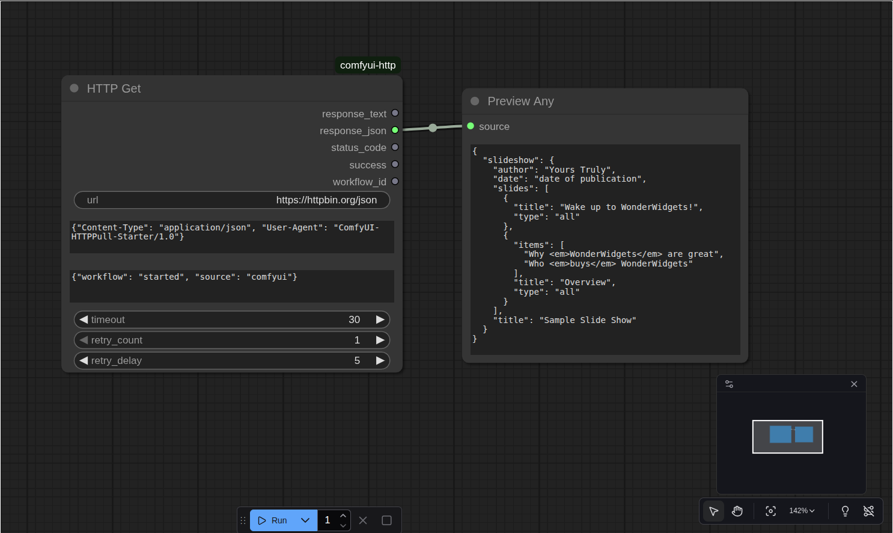

# ComfyUI-HTTP

[](https://www.python.org/downloads/)
[](https://opensource.org/licenses/MIT)
[](https://github.com/psf/black)
[](https://github.com/wawahuy/ComfyUI-HTTP/graphs/commit-activity)



**Professional HTTP integration nodes for ComfyUI workflows** - Transform your ComfyUI experience with seamless web API connectivity, enabling powerful automation and data exchange capabilities.

## Features

### Core HTTP Operations
- **HTTP GET**: Fetch data from REST APIs with advanced parameter handling
- **HTTP POST**: Send JSON, form data, and raw payloads with comprehensive options
- **JSON Field Extraction**: Parse and extract specific fields from JSON responses
- **Form Data Management**: Build complex multipart form data with files and images

### Image Processing Integration
- **Base64 ↔ Image Conversion**: Seamlessly convert between image formats and base64 encoding
- **File Upload Support**: Direct file and image uploads through HTTP requests
- **Image Pipeline Integration**: Perfect integration with ComfyUI's image processing workflows

### Advanced Capabilities
- **Performance Optimized**: Efficient HTTP client with connection pooling and timeouts
- **Error Handling**: Robust error handling with detailed feedback and retry mechanisms
- **Flexible Configuration**: Customizable headers, parameters, and request options
- **Comprehensive Logging**: Detailed logging for debugging and monitoring

## Quick Start

### Installation

#### Method 1: ComfyUI Manager (Recommended)
1. Open ComfyUI Manager
2. Search for "ComfyUI-HTTP"
3. Click Install

#### Method 2: Manual Installation
```bash
cd ComfyUI/custom_nodes/
git clone https://github.com/wawahuy/ComfyUI-HTTP.git
cd ComfyUI-HTTP
pip install -r requirements.txt
```

### Basic Usage

Once installed, you'll find new HTTP nodes in your ComfyUI node menu:

- **HTTP Get** - Perform GET requests
- **HTTP Post JSON** - Send JSON data
- **HTTP Post Form Data** - Send form data with files
- **HTTP Get JSON Field** - Extract JSON fields
- **Base64 to Image** - Convert base64 to images
- **Image to Base64** - Convert images to base64

## Documentation

### Node Reference

#### HTTP Get Node
Performs HTTP GET requests with customizable parameters and headers.

**Inputs:**
- `url` (string): Target URL
- `headers` (string, optional): JSON-formatted headers
- `params` (string, optional): JSON-formatted query parameters
- `timeout` (int): Request timeout in seconds

**Outputs:**
- `response` (string): Response body
- `status_code` (int): HTTP status code
- `headers` (string): Response headers

**Example:**
```json
{
  "url": "https://api.example.com/data",
  "headers": {
    "Authorization": "Bearer your-token",
    "Content-Type": "application/json"
  },
  "params": {
    "limit": 10,
    "page": 1
  }
}
```

#### HTTP Post JSON Node
Sends JSON data via POST requests.

**Inputs:**
- `url` (string): Target URL
- `json_data` (string): JSON payload
- `headers` (string, optional): Custom headers
- `timeout` (int): Request timeout

**Outputs:**
- `response` (string): Response body
- `status_code` (int): HTTP status code

#### HTTP Post Form Data Node
Handles multipart form data with file uploads.

**Inputs:**
- `url` (string): Target URL
- `form_data` (HTTPFormData): Form data object
- `headers` (string, optional): Additional headers
- `timeout` (int): Request timeout

#### Form Data Builder Nodes

##### HTTP Form Text Item
Creates text form fields.

**Inputs:**
- `name` (string): Field name
- `value` (string): Field value

##### HTTP Form File Item
Creates file upload fields.

**Inputs:**
- `name` (string): Field name
- `file_path` (string): Path to file
- `mime_type` (string, optional): File MIME type

##### HTTP Form Image Item
Creates image upload fields from ComfyUI images.

**Inputs:**
- `name` (string): Field name
- `image` (IMAGE): ComfyUI image tensor
- `filename` (string): Filename for upload
- `format` (string): Image format (PNG, JPEG, etc.)

#### Utility Nodes

##### HTTP Get JSON Field
Extracts specific fields from JSON responses.

**Inputs:**
- `json_data` (string): JSON string
- `field_path` (string): Dot-notation field path (e.g., "data.items.0.name")

**Outputs:**
- `value` (string): Extracted field value

##### Base64 to Image
Converts base64 encoded images to ComfyUI image tensors.

**Inputs:**
- `base64_string` (string): Base64 encoded image

**Outputs:**
- `image` (IMAGE): ComfyUI image tensor

##### Image to Base64
Converts ComfyUI images to base64 strings.

**Inputs:**
- `image` (IMAGE): ComfyUI image tensor
- `format` (string): Output format (PNG, JPEG)

**Outputs:**
- `base64_string` (string): Base64 encoded image

### Workflow Examples

#### Example 1: API Data Fetching
```json
{
  "workflow": "Fetch user data from API",
  "nodes": [
    {
      "type": "HTTP Get",
      "url": "https://jsonplaceholder.typicode.com/users/1",
      "headers": "{\"Accept\": \"application/json\"}"
    },
    {
      "type": "HTTP Get JSON Field",
      "field_path": "name"
    }
  ]
}
```

#### Example 2: Image Upload to API
```json
{
  "workflow": "Upload generated image to API",
  "nodes": [
    {
      "type": "Image to Base64",
      "format": "PNG"
    },
    {
      "type": "HTTP Form Image Item",
      "name": "image",
      "filename": "generated.png"
    },
    {
      "type": "HTTP Post Form Data",
      "url": "https://api.example.com/upload"
    }
  ]
}
```

#### Example 3: AI Service Integration
```json
{
  "workflow": "Send image to AI service and get results",
  "nodes": [
    {
      "type": "Image to Base64"
    },
    {
      "type": "HTTP Post JSON",
      "url": "https://ai-service.com/analyze",
      "json_data": "{\"image\": \"{{base64}}\", \"model\": \"v2\"}"
    },
    {
      "type": "HTTP Get JSON Field",
      "field_path": "result.confidence"
    }
  ]
}
```

## Development

### Prerequisites
- Python 3.8+
- ComfyUI
- Git

### Development Setup

1. **Clone the repository:**
   ```bash
   git clone https://github.com/wawahuy/ComfyUI-HTTP.git
   cd ComfyUI-HTTP
   ```

2. **Install development dependencies:**
   ```bash
   pip install -e ".[dev]"
   ```

3. **Install pre-commit hooks:**
   ```bash
   pre-commit install
   ```

4. **Run tests:**
   ```bash
   pytest
   ```

### Code Quality

This project maintains high code quality standards:

- **Formatting**: [Black](https://github.com/psf/black)
- **Import Sorting**: [isort](https://pycqa.github.io/isort/)
- **Linting**: [Flake8](https://flake8.pycqa.org/)
- **Type Checking**: [MyPy](https://mypy.readthedocs.io/)
- **Testing**: [pytest](https://pytest.org/)

### Running Quality Checks

```bash
# Format code
black .
isort .

# Lint code
flake8 .

# Type checking
mypy .

# Run tests with coverage
pytest --cov=. --cov-report=html
```

### Project Structure

```
ComfyUI-HTTP/
├── __init__.py                 # Main module initialization
├── http_get.py                # HTTP GET node implementation
├── http_post_json.py          # HTTP POST JSON node
├── http_post_form_data.py     # HTTP POST form data node
├── http_post_raw.py           # HTTP POST raw data node
├── http_get_json_field.py     # JSON field extraction
├── http_form_data.py          # Form data container
├── http_form_data_concat.py   # Form data concatenation
├── http_form_text_item.py     # Text form field
├── http_form_file_item.py     # File form field
├── http_form_image_item.py    # Image form field
├── base64_to_image.py         # Base64 to image converter
├── image_to_base64.py         # Image to base64 converter
├── node_metadata.json         # Node metadata for ComfyUI
├── requirements.txt           # Python dependencies
├── pyproject.toml            # Project configuration
├── README.md                 # This file
├── PR_RULES.md              # Contribution guidelines
└── tests/                   # Test suite
    ├── test_http_nodes.py   # HTTP node tests
    ├── test_form_data.py    # Form data tests
    └── test_converters.py   # Converter tests
```

## Contributing

We welcome contributions! Please see our [Pull Request Guidelines](PR_RULES.md) for detailed information on:

- Code style and standards
- Testing requirements
- Documentation guidelines
- Review process

### Quick Contribution Guide

1. **Fork** the repository
2. **Create** a feature branch (`git checkout -b feature/amazing-feature`)
3. **Commit** your changes (`git commit -m 'feat: add amazing feature'`)
4. **Push** to the branch (`git push origin feature/amazing-feature`)
5. **Open** a Pull Request

### Development Commands

```bash
# Install in development mode
pip install -e ".[dev]"

# Run all tests
pytest

# Run tests with coverage
pytest --cov=. --cov-report=term-missing

# Format code
black . && isort .

# Lint code
flake8 . && mypy .

# Build package
python -m build
```

## License

This project is licensed under the MIT License - see the [LICENSE](LICENSE) file for details.

## Acknowledgments

- **ComfyUI Team** - For creating an amazing platform for AI workflows
- **Contributors** - Thank you to all who have contributed to this project
- **Community** - For feedback, bug reports, and feature requests

## Support

- **GitHub Issues**: [Report bugs or request features](https://github.com/wawahuy/ComfyUI-HTTP/issues)
- **GitHub Discussions**: [Ask questions or share ideas](https://github.com/wawahuy/ComfyUI-HTTP/discussions)
- **Documentation**: Check this README and code comments for usage examples

## Roadmap

### Upcoming Features

- **Authentication Support**: OAuth, API keys, JWT tokens
- **WebSocket Integration**: Real-time communication capabilities
- **GraphQL Support**: GraphQL query and mutation nodes
- **Testing Framework**: Built-in HTTP mocking for workflow testing
- **Performance Monitoring**: Request timing and performance metrics
- **Security Enhancements**: Request validation and sanitization
- **Proxy Support**: HTTP proxy configuration options
- **Batch Operations**: Bulk HTTP requests and parallel processing

### Version History

- **v1.0.0** - Initial release with core HTTP functionality
- **v0.9.0** - Beta release with form data support
- **v0.8.0** - Alpha release with basic GET/POST operations

---

<div align="center">

**[Star this project](https://github.com/wawahuy/ComfyUI-HTTP/stargazers) | [Fork it](https://github.com/wawahuy/ComfyUI-HTTP/fork) | [Report Issues](https://github.com/wawahuy/ComfyUI-HTTP/issues)**

Made with love for the ComfyUI community

</div>